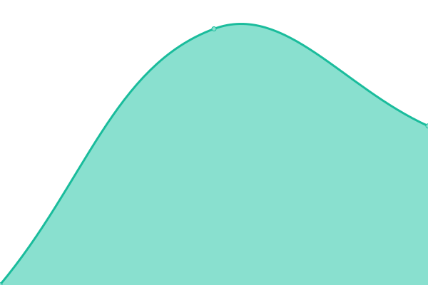
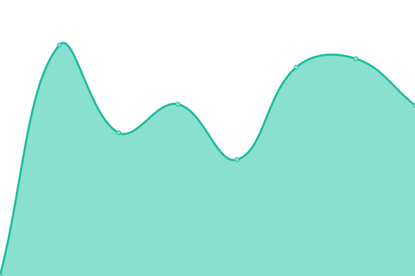

# [📈 Live Status](https://status.dsr.re): <!--live status--> **🟥 Complete outage**

This repository contains the open-source uptime monitor and status page for [DeSiRE](https://dsr.re), powered by [Upptime](https://github.com/upptime/upptime).

With [Upptime](https://upptime.js.org), you can get your own unlimited and free uptime monitor and status page, powered entirely by a GitHub repository. We use [Issues](https://github.com/desire-creations/status.dsr.re/issues) as incident reports, [Actions](https://github.com/desire-creations/status.dsr.re/actions) as uptime monitors, and [Pages](https://status.dsr.re) for the status page.

<!--start: status pages-->
<!-- This summary is generated by Upptime (https://github.com/upptime/upptime) -->
<!-- Do not edit this manually, your changes will be overwritten -->
<!-- prettier-ignore -->
| URL | Status | History | Response Time | Uptime |
| --- | ------ | ------- | ------------- | ------ |
|  [DSR Website](https://dsr.re) | 🟥 Down | [dsr-website.yml](https://github.com/desire-creations/status.dsr.re/commits/HEAD/history/dsr-website.yml) | 

 0ms
     
 | 

<a href="https://status.dsr.re/history/dsr-website">0.00%</a>
    

|  [General use API](https://api.dsr.re) | 🟥 Down | [general-use-api.yml](https://github.com/desire-creations/status.dsr.re/commits/HEAD/history/general-use-api.yml) | 

 0ms
     
 | 

<a href="https://status.dsr.re/history/general-use-api">0.00%</a>
    

|  [CDN](https://cdn.dsr.re) | 🟥 Down | [cdn.yml](https://github.com/desire-creations/status.dsr.re/commits/HEAD/history/cdn.yml) | 

 0ms
     
 | 

<a href="https://status.dsr.re/history/cdn">0.00%</a>
    

<!--end: status pages-->

[**Visit our status website →**](https://status.dsr.re)

## 📄 License

- Powered by: [Upptime](https://github.com/upptime/upptime)
- Code: [MIT](./LICENSE) © [DeSiRE](https://dsr.re)
- Data in the `./history` directory: [Open Database License](https://opendatacommons.org/licenses/odbl/1-0/)
